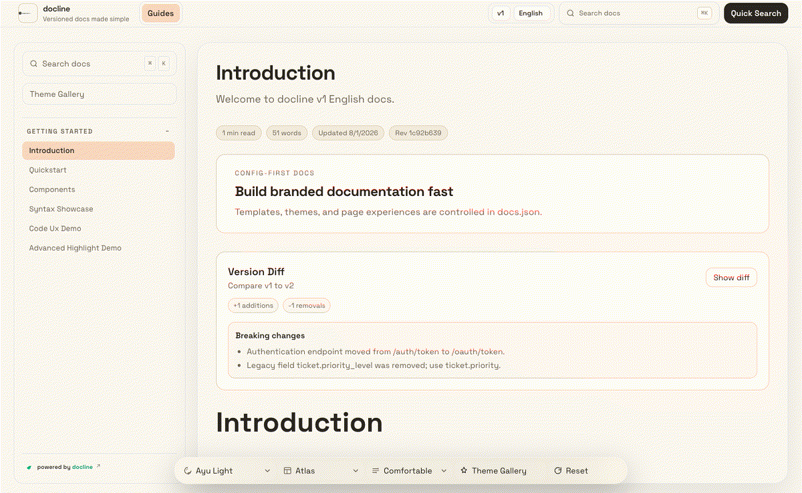

# docline

docline helps teams publish beautiful, structured documentation fast, with lower cost and full ownership.

Built for teams moving away from expensive paid tools, docline gives you a professional docs experience without platform lock-in.

[](https://www.npmjs.com/package/create-docline)
[](https://github.com/doclines/docline-core/blob/main/LICENSE)
[](https://github.com/doclines/docline-core/actions/workflows/deploy-github-pages.yml)
[](https://doclines.github.io/docline-core/index.html)

## Live Theme Previews

Animated theme tour:

[](https://doclines.github.io/docline-core/index.html)

Effects tour (theme + contrast + density + reading focus):

[](https://doclines.github.io/docline-core/index.html?version=v1&lang=en&theme=night-owl&contrast=high&density=compact&reading=on)

<details>
<summary>Theme preview dropdown (12 themes)</summary>

| Ayu Light | Catppuccin Latte | GitHub Light |
| --- | --- | --- |
| [](https://doclines.github.io/docline-core/index.html?version=v1&lang=en&theme=ayu-light) | [](https://doclines.github.io/docline-core/index.html?version=v1&lang=en&theme=catppuccin-latte) | [](https://doclines.github.io/docline-core/index.html?version=v1&lang=en&theme=github-light) |

| Solarized Light | Tokyo Night Storm | Dracula Pro |
| --- | --- | --- |
| [](https://doclines.github.io/docline-core/index.html?version=v1&lang=en&theme=solarized-light) | [](https://doclines.github.io/docline-core/index.html?version=v1&lang=en&theme=tokyo-night-storm) | [](https://doclines.github.io/docline-core/index.html?version=v1&lang=en&theme=dracula-pro) |

| One Dark Pro | Night Owl | Solarized Dark |
| --- | --- | --- |
| [](https://doclines.github.io/docline-core/index.html?version=v1&lang=en&theme=one-dark-pro) | [](https://doclines.github.io/docline-core/index.html?version=v1&lang=en&theme=night-owl) | [](https://doclines.github.io/docline-core/index.html?version=v1&lang=en&theme=solarized-dark) |

| Material Ocean | Catppuccin Mocha | Gruvbox Dark |
| --- | --- | --- |
| [](https://doclines.github.io/docline-core/index.html?version=v1&lang=en&theme=material-ocean) | [](https://doclines.github.io/docline-core/index.html?version=v1&lang=en&theme=catppuccin-mocha) | [](https://doclines.github.io/docline-core/index.html?version=v1&lang=en&theme=gruvbox-dark) |

</details>

Open live docs: https://doclines.github.io/docline-core/index.html


## Core Features

- Feature-first configuration for consistent documentation at scale
- Fast, reliable search across all pages
- Rich authoring experience with reusable content blocks
- Versioned and multilingual documentation support
- Portable output you can host anywhere
- Built-in quality checks for content health and accessibility

## Quick Start

```bash
npx create-docline@1.0.2 my-docs
cd my-docs
npx create-docline@1.0.2 dev
```

## Scaffold Options

- `--docs-mode standard` for single-context docs
- `--docs-mode versioned` for version + locale docs
- `--branding keep|remove` for attribution preference
- `--badge-style minimal|full` for branding style
- `--pm npm|pnpm|yarn|bun` for package manager selection
- `--no-install` to skip dependency installation

## Main Commands

- `npx create-docline@1.0.2 dev` start local preview
- `npx create-docline@1.0.2 validate` run docs/config validation
- `npx create-docline@1.0.2 broken-links` check internal links and anchors
- `npx create-docline@1.0.2 check` run validation + link checks
- `npx create-docline@1.0.2 a11y` run accessibility checks
- `npx create-docline@1.0.2 export` create distributable static package

## Deployment

docline output is deployment-ready and can be hosted on any modern static hosting platform.

## Repository

```bash
git clone https://github.com/doclines/docline-core
cd docline-core
npm install
npm run dev
```
## License
MIT